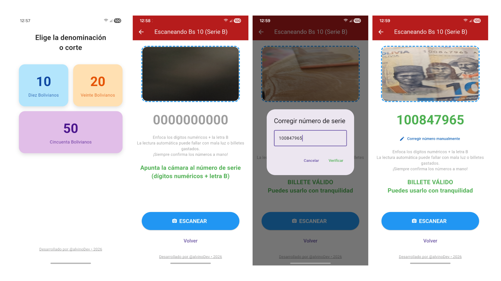
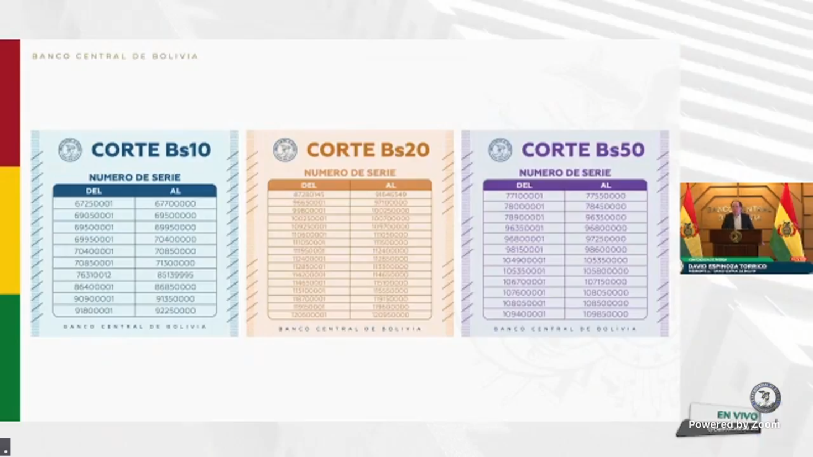
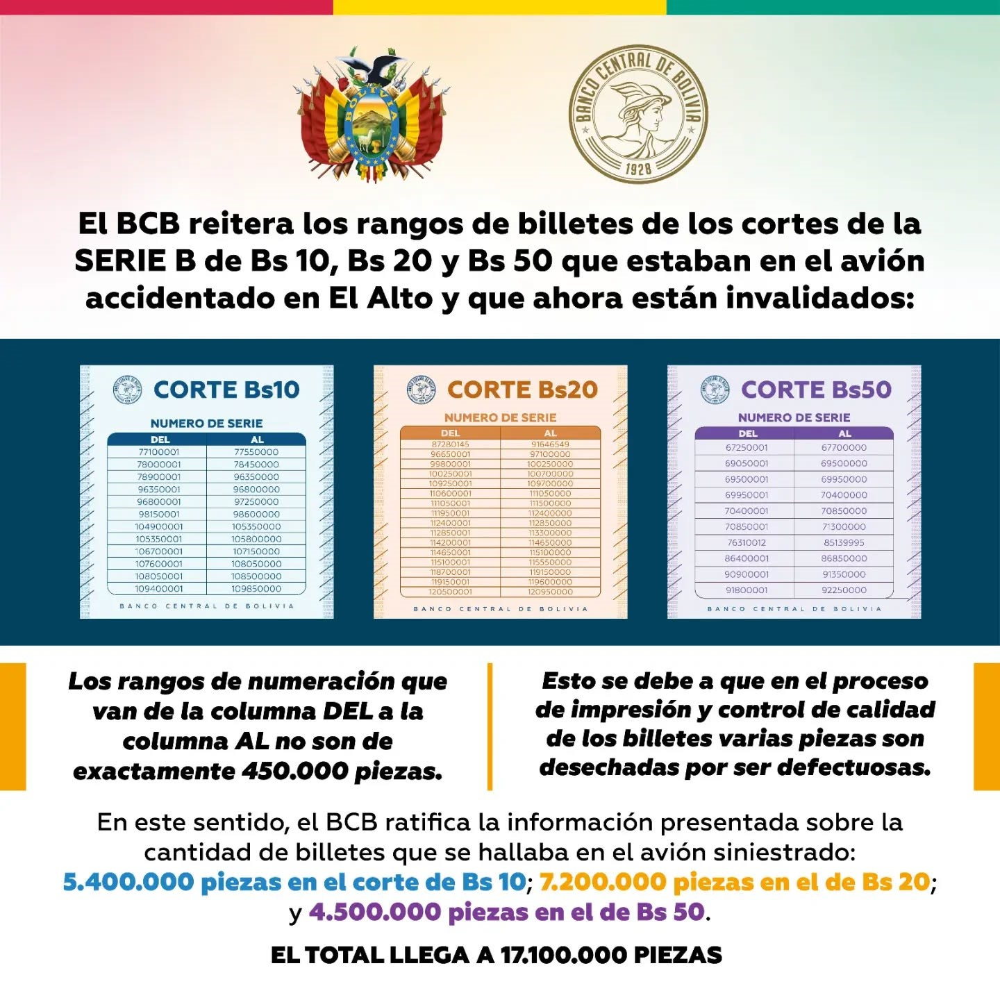
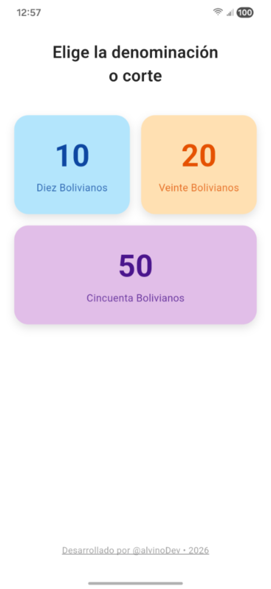
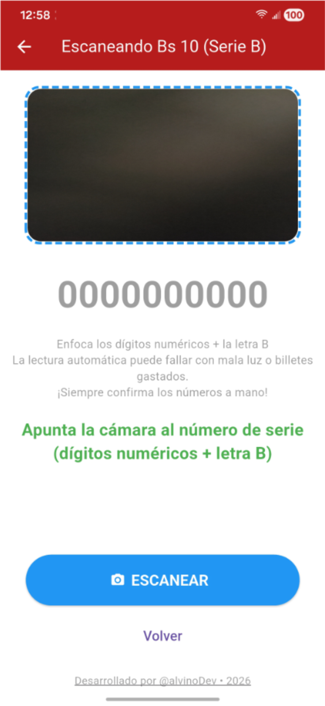
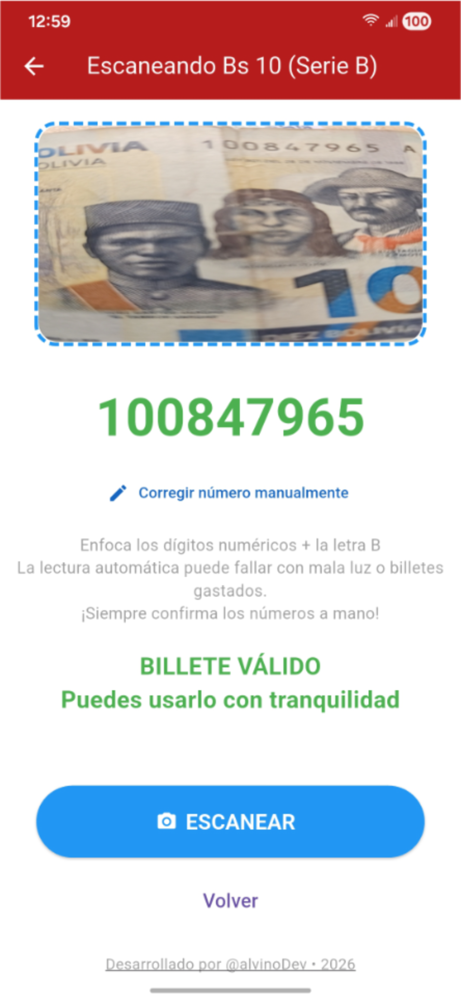

# Verifica - Serie B Bolivia

**App para verificar billetes inhabilitados de la "Serie B" inhabilitados (Bs 10, 20 y 50)**

  

## Actualización importante: Rangos oficiales corregidos (1 de marzo 2026)

La primera versión de **Verifica** (v1.0.0) se basó en la información transmitida el **sábado 28 de febrero de 2026** por el Banco Central de Bolivia (ver transmisión: https://www.facebook.com/BancoCentralBO/videos/1595089078458729), donde los rangos parecían tener un orden invertido entre Bs 10 y Bs 50.

El **domingo 1 de marzo de 2026** (aprox. 17:58), el BCB publicó la lista oficial corregida (ver post: https://www.facebook.com/BancoCentralBO/posts/pfbid0zbhVZ7etopvGtXhp5sFAtemm7Bwy2XRVLzMBfqEC5LxfzQJPdjsMhFiiouyPKN5pl), con el orden correcto de los rangos.

- En el siguiente enlace encontrarás el listado correspondiente de los billetes inhabilitados de Bs10. [Lista de billetes inhabilitados de Bs 10](https://www.bcb.gob.bo/webdocs/series_10.jpg)
- En el siguiente enlace encontrarás el listado correspondiente de los billetes inhabilitados de Bs20. [Lista de billetes inhabilitados de Bs 20](https://www.bcb.gob.bo/webdocs/series_20.jpg)
- En el siguiente enlace encontrarás el listado correspondiente de los billetes inhabilitados de Bs50. [Lista de billetes inhabilitados de Bs 50](https://www.bcb.gob.bo/webdocs/series_50.jpg)

**Esta versión actual (v1.1.0 o superior) ya usa los rangos precisos de la publicación corregida del 1 de marzo.**

Siempre recomendamos verificar directamente en fuentes oficiales del BCB, ya que esta app es una ayuda comunitaria no oficial. Si ves discrepancias, por favor abre un issue en el repositorio.

Gracias por entender y por ayudar a difundir la versión actualizada.

## Evidencias

| sábado 28 de febrero                | domingo 1 de marzo                  |
|-------------------------------------|-------------------------------------|
|        |  |

## ¿Qué hace esta app?

Verifica al instante si un billete de **Bs 10, 20 o 50** (Serie B) está inhabilitado según las listas oficiales publicadas por el Ministerio de Economía y Finanzas Públicas de Bolivia.

- Escanea el número de serie con la cámara del celular  
- Detecta automáticamente si está en los rangos inhabilitados  
- Permite corregir manualmente si la lectura automática falla  
- 100% offline – no necesita internet  

¡Ideal para mercados, tiendas, transporte y uso diario en Bolivia!

## Capturas de pantalla

| Pantalla principal                  | Escaneo Bs 10                       | Resultado inhabilitado              |
|-------------------------------------|-------------------------------------|-------------------------------------|
|        |  |  |

## Requisitos

- Android 6.0 o superior  
- Cámara funcional  
- Permiso de cámara (la app lo pide al iniciar)

## Cómo instalar (para usuarios)

1. **Descarga el APK** que mejor se adapte a tu celular Android:

   - **Recomendado para la mayoría** (celulares modernos desde 2018 en adelante – Samsung, Xiaomi, Motorola, etc.):  
     [⬇️ app-arm64-v8a-release.apk (125 MB)](https://github.com/alvinoDev/verificador_billetes_bo/releases/download/v1.1.0/app-arm64-v8a-release.apk)

   - **Solo si tienes un celular muy antiguo** (modelos de 2015-2018 o low-end que no instala el de arriba):  
     [⬇️ app-armeabi-v7a-release.apk (97 MB)](https://github.com/alvinoDev/verificador_billetes_bo/releases/download/v1.1.0/app-armeabi-v7a-release.apk)

   *(No necesitas descargar el de x86_64, es para emuladores y casos muy raros)*

2. En tu celular Android:
   - Ve a **Ajustes > Seguridad** (o Busca "Fuentes desconocidas")
   - Activa "Instalar apps de fuentes desconocidas" para el navegador o administrador de archivos
   - Abre el archivo APK descargado y toca **Instalar**

3. ¡Listo! Abre la app y empieza a verificar billetes.

**Nota importante**: Esta app usa datos oficiales publicados por el gobierno boliviano (rangos de Serie B inhabilitados). Siempre confirma manualmente en casos dudosos.

## Cómo generar los APKs tú mismo (para desarrolladores)

```bash
# Clona el repo
git clone https://github.com/alvinoDev/verificador-billetes-bo.git
cd verificador-billetes-bo

# Instala dependencias
flutter pub get

# Genera los APKs release (split por ABI)
flutter build apk --release --split-per-abi
